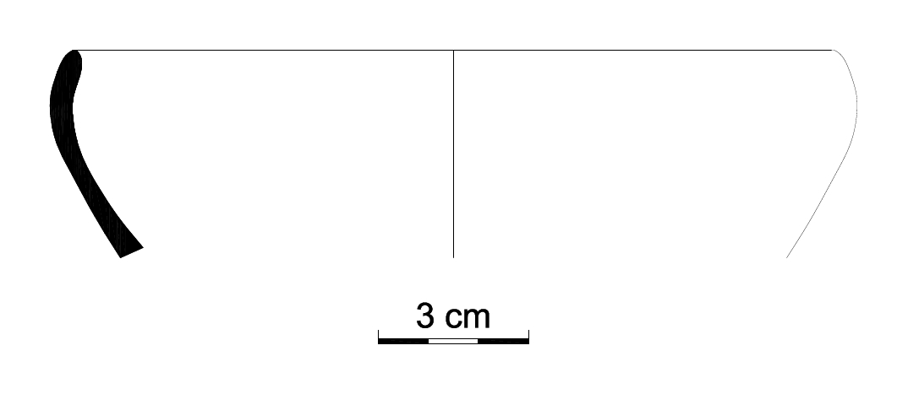

# morphotype

<!-- badges: start -->

[](https://zenodo.org/badge/latestdoi/485943302)
<!-- badges: end -->

The goal of morphotype is to provide a pipeline from shape data
extraction to typological arrangement of pottery profiles.

## Installation

You can install the development version of morphotype from
[GitHub](https://github.com/) with:

``` r
# install.packages("devtools")
devtools::install_github("kafetzakid/morphotype")
```

## Example

Below is a basic example which shows you how to solve a common problem.
Note that ‘?raw=true’ is pasted on the actual filename to access the
image in github. When you read images locally, use the name of your
image file including extension, for instance ‘SADR010324.jpg’.

``` r
library(morphotype)
drawing_img = magick::image_read('https://github.com/kafetzakid/morphotype/blob/main/inst/extdata/SADR010324.jpg?raw=true') 
print(drawing_img)
#> # A tibble: 1 × 7
#>   format width height colorspace matte filesize density
#>   <chr>  <int>  <int> <chr>      <lgl>    <int> <chr>  
#> 1 JPEG    1074    467 sRGB       FALSE    28592 300x300
```



``` r
img_data = morphotype::get_input(filename = 'SADR010324.jpg?raw=true', trim = 10, thr = 0.9, wd = 'https://github.com/kafetzakid/morphotype/blob/main/inst/extdata')
str(img_data)
#> List of 2
#>  $ matrix     : num [1:1054, 1:447] 0 0 0 0 0 0 0 0 0 0 ...
#>  $ alternative: NULL
```
